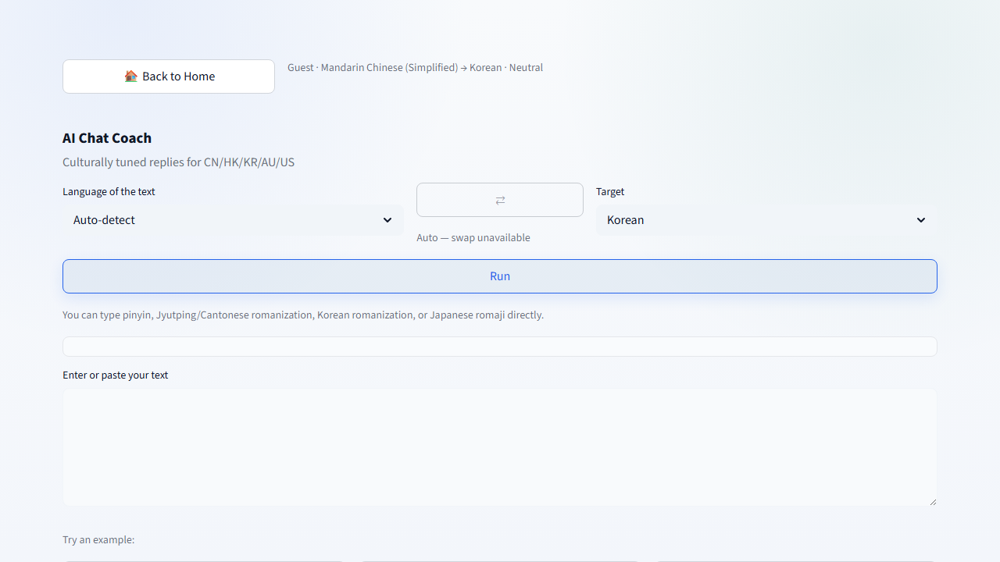
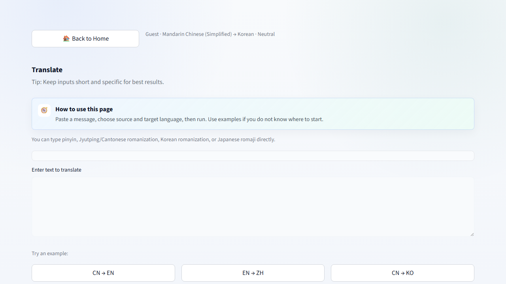
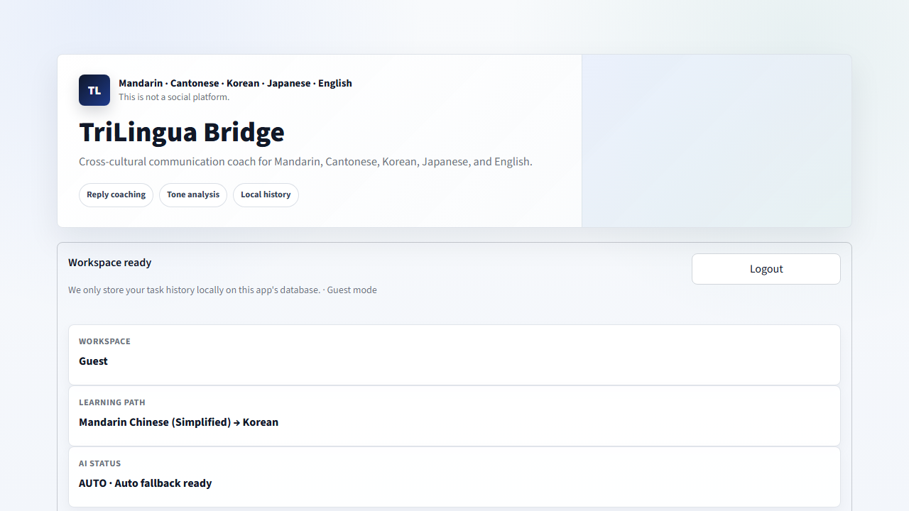
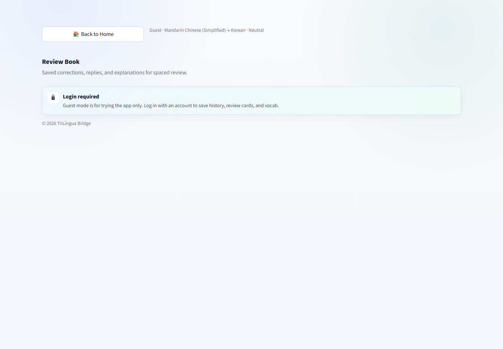
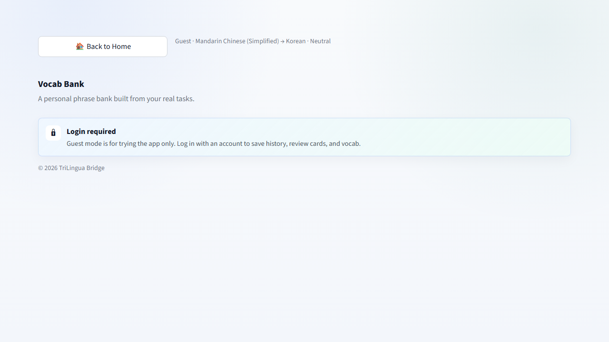
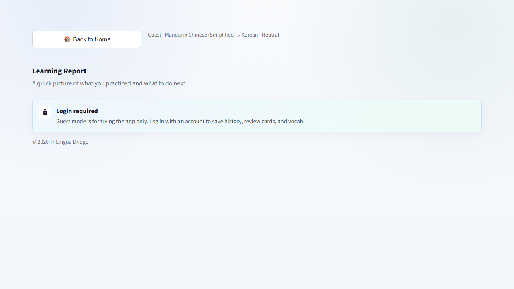

<p align="center">
  
</p>

<h1 align="center">🌐 TriLingua Bridge</h1>

<p align="center">
  <strong>An AI Cross-Language Communication Coach</strong>
  <br>
  Not just translation — tone, cultural context, and "would a native actually say this?" feedback.
</p>

<p align="center">
  <a href="CHANGELOG.md"></a>
  <a href="CHANGELOG.md"></a>
  
  
  
  <br>
  
  
  <br>
  <a href="docs/architecture.md">📐 Architecture</a> ·
  <a href="CHANGELOG.md">📋 Changelog</a> ·
  <a href="CONTRIBUTING.md">🤝 Contributing</a> ·
  <a href="docs/demo-script.md">🎥 Demo Script</a>
</p>

---

## 📖 Overview

TriLingua Bridge helps language learners write natural, culturally appropriate messages across **Mandarin Chinese, Cantonese, Korean, Japanese, and English**.

It is not a translation tool. It is a **communication coach**: you describe the situation, and it helps you craft a reply that sounds natural — with tone analysis, cultural notes, pronunciation guides, and vocabulary explanations built in.

**Live demo:** [streamlit.app link — coming soon]  
**Demo video:** [2-minute walkthrough — coming soon]

---

## 🧠 Problem Statement

Existing tools leave a gap:

| Tool | What it does | What it misses |
|------|-------------|----------------|
| **Google Translate** | Word-for-word translation | Tone, register, cultural appropriateness, regional politeness |
| **DeepL** | Natural-sounding translation | No coaching, no explanation, no follow-up |
| **ChatGPT / Claude** | Can do all of this | Requires careful prompting each time; no structured output, no workspace, no learning system |
| **Textbooks / Classes** | Teach grammar systematically | Don't help with real-time chat situations |

**The real question learners face isn't "what does this mean?" — it's "can I actually send this?"**

TriLingua Bridge answers that question by combining:
- **AI coaching** with structured JSON output (not free-form chat)
- **Workspace persistence** (review book, vocab bank, history)
- **Conversation memory** (the AI remembers what you talked about)
- **Multi-region cultural calibration** (mainland China vs Hong Kong vs Korea vs Japan vs Australia vs US)

---

## ✨ Key Features

### 🤖 AI Coach (the main product)
- Region-aware reply suggestions (CN mainland, HK Cantonese, Korea, Japan, Australia, US)
- Relationship context (friend, crush, work, formal, cute, cold)
- Tone analysis with scores + improvement suggestions
- Cultural notes explaining why a phrasing works
- Hidden meaning detection
- **Conversation memory** — AI remembers previous turns
- **Quick language swap** — change source/target without leaving the page

### 🗣️ Language Tools
- **Translate** — context-aware translation with native-language explanations
- **Grammar** — level-based error correction with reusable patterns
- **Natural Expression** — turn translated-sounding text into something sendable
- **Vocabulary** — phrase-by-phrase explanations with examples

### 🎧 Media & Culture
- K-pop lyrics, drama lines, internet slang explained
- Cultural context for pop culture references

### 🎤 Voice & Audio
- **Speech-to-text** via OpenAI Whisper (microphone or file upload)
- **Text-to-speech** via OpenAI TTS or gTTS
- **Romanization**: Pinyin, Jyutping, Hangul romaji, Japanese Hepburn, IPA

### 📚 Workspace
- **Review Book** — save AI outputs as spaced-revision cards
- **Vocab Bank** — personal phrase collection with examples
- **Learning Report** — points, streak, weekly chart, mode tracking
- **History** — filterable, searchable task log with CSV export

### 🌍 Internationalisation
- **5 UI languages**: English, 简体中文, 한국어, 繁體中文/粵語, 日本語
- **5 learning languages**: Mandarin, Cantonese, Korean, Japanese, English
- All AI output respects target language and native language independently

### 🔐 Security
- PBKDF2-HMAC-SHA256 with per-user 16-byte random salt
- Constant-time password comparison (`hmac.compare_digest`)
- SQLite WAL mode with foreign keys
- All HTML output is escaped

---

## 📸 Screenshots

| Coach Page | Translate | History |
|-----------|-----------|---------|
|  |  |  |

| Review Book | Vocab Bank | Learning Report |
|------------|-----------|----------------|
|  |  |  |

---

## 🏗️ Architecture

```
┌──────────────────────────────────────────────────┐
│                    app.py                        │
│  Streamlit entry · page router · session state   │
└──────────┬─────────────────┬────────────────┬────┘
           │                 │                │
    ┌──────▼──────┐   ┌──────▼──────┐   ┌──────▼──────┐
    │ ui_helper.py │   │ ai_helper.py │   │audio_helper │
    │ i18n, CSS,   │   │ Multi-AI,    │   │ TTS, STT,   │
    │ components   │   │ prompts,     │   │ romanize    │
    │              │   │ guard layers │   │             │
    └──────────────┘   └──────────────┘   └─────────────┘
                             │
                    ┌────────▼────────┐
                    │   db_helper.py   │
                    │ SQLite · Auth ·  │
                    │ History · Vocab  │
                    └─────────────────┘
                             │
                    ┌────────▼────────┐
                    │ trilingua_bridge │
                    │     .db          │
                    │ (SQLite WAL)     │
                    └──────────────────┘

         ┌──────────────────────────────────────┐
         │            run.py (PWA proxy)         │
         │  HTTP proxy · WebSocket tunnel ·      │
         │  manifest.json · sw.js · icons        │
         └──────────────────────────────────────┘
```

### AI Prompt Architecture

The system prompt is constructed from three composable guard layers:

| Layer | Purpose | Example |
|-------|---------|---------|
| `language_rules()` | Defines language codes and output rules | "ja = Japanese" |
| `strict_language_guard()` | Enforces output language compliance | "Do not switch to Korean" |
| `quality_guard()` | Safety, explanation language field rules | "notes must be in native_lang" |

This design means adding a new language requires updating **one function** — no individual prompt changes.

### Conversation Memory

```
User input → st.session_state.coach_conversation (max 12 messages)
     ↓
Last 8 messages injected as context into AI prompt
     ↓
AI response appended to memory
     ↓
Oldest messages trimmed FIFO at limit
```

Memory is **ephemeral by design** — stored in session state, not the database. This avoids schema migration and matches the use case (a coaching session, not a permanent chat log).

---

## 🛠️ Tech Stack

| Layer | Technology | Why |
|-------|-----------|-----|
| **Frontend** | [Streamlit](https://streamlit.io) | Rapid AI UX prototyping, built-in state management, easy deployment |
| **PWA** | Custom proxy (`run.py`) + Service Worker | Installable as standalone app, offline fallback, full-screen mode |
| **AI Providers** | OpenAI · Anthropic Claude · DeepSeek | Multi-provider with automatic fallback — no single point of failure |
| **Speech (STT)** | OpenAI Whisper | Industry-leading transcription quality, supports all 5 languages |
| **Speech (TTS)** | OpenAI TTS / gTTS | Premium neural voices + free fallback |
| **Romanization** | `pypinyin` · `pycantonese` · `hangul-romanize` · `pykakasi` · `eng-to-ipa` | Native-script pronunciation guides for all 5 languages |
| **Storage** | SQLite (WAL mode) | Zero infrastructure, appropriate for single-user workspace |
| **Auth** | PBKDF2-HMAC-SHA256 (120k iterations) | Secure local authentication without third-party dependencies |
| **Container** | Docker (optional) | Consistent environment for development and deployment |
| **Quality** | Ruff · pytest | Linting and testing |

---

## 🚀 Installation

### Prerequisites

- Python 3.11 or later
- At least one AI provider API key (OpenAI, Anthropic, or DeepSeek)

### Local Setup

```bash
# Clone the repository
git clone https://github.com/thomasyeung79/trilingua-bridge.git
cd trilingua-bridge

# Create and activate virtual environment
python -m venv .venv
source .venv/bin/activate         # macOS/Linux
# .venv\Scripts\activate          # Windows PowerShell

# Install dependencies
pip install -r requirements.txt

# (optional) Install dev tools for testing
pip install -r dev-requirements.txt

# Configure API keys
cp .env.example .env
# Edit .env with your API keys
```

### Environment Variables

| Variable | Required | Default | Purpose |
|----------|----------|---------|---------|
| `OPENAI_API_KEY` | Yes* | — | OpenAI access (text, TTS, Whisper STT) |
| `ANTHROPIC_API_KEY` | No* | — | Anthropic Claude access (text) |
| `DEEPSEEK_API_KEY` | No* | — | DeepSeek access (text fallback) |
| `OPENAI_MODEL` | No | `gpt-4o-mini` | Override OpenAI model |
| `ANTHROPIC_MODEL` | No | `claude-sonnet-4-20250514` | Override Anthropic model |
| `DEEPSEEK_MODEL` | No | `deepseek-chat` | Override DeepSeek model |
| `AI_PROVIDER` | No | `auto` | `auto`, `openai`, `deepseek`, or `anthropic` |
| `DB_PATH` | No | `trilingua_bridge.db` | Override SQLite path |

*\* At least one provider key is required. With multiple configured, the app falls back in order: OpenAI → Anthropic → DeepSeek.*

### Running Locally

**Streamlit mode:**
```bash
streamlit run app.py
# → http://localhost:8501
```

**PWA mode (recommended):**
```bash
python run.py
# → http://localhost:8500
# Installable as standalone app via browser menu
```

**Other options:**
```bash
python run.py --direct       # Streamlit only (skip PWA proxy)
python run.py --port 3000    # Custom port
python run.py --no-browser   # Don't auto-open
```

**Windows:**
```bash
run.bat
```

---

## 📁 Project Structure

```
trilingua-bridge/
├── app.py                  # Streamlit entry point & page router
├── run.py                  # PWA launcher (proxy + WebSocket tunnel)
├── run.bat                 # Windows launcher
│
├── ai_helper.py            # AI provider abstraction + prompt scaffolding
├── ui_helper.py            # i18n dictionary, CSS, rendering components
├── audio_helper.py         # TTS, STT, romanization (all 5 languages)
├── db_helper.py            # SQLite schema, auth, CRUD for all tables
│
├── modules/
│   ├── pages.py            # All page rendering functions
│   └── styles.py           # Product-specific CSS
│
├── pwa/
│   ├── manifest.json       # PWA manifest
│   ├── sw.js               # Service Worker
│   ├── icon.svg            # App icon (vector)
│   └── gen_icons.py        # PNG icon generator
│
├── tests/
│   ├── test_basic.py       # Unit tests for helper functions
│   └── test_i18n.py        # Internationalisation consistency tests
│
├── .streamlit/
│   ├── config.toml         # Streamlit theme & server settings
│   └── secrets.toml.example
│
├── .env.example
├── requirements.txt
├── pyproject.toml           # Ruff + pytest config
└── Dockerfile
```

---

## 📐 Design Decisions

The following decisions were made intentionally. See [`docs/architecture.md`](docs/architecture.md) for detailed diagrams and data flow.

Full Architecture Decision Records are planned in [`docs/adr/`](docs/adr/).

### Why Streamlit (not FastAPI + React)?

Streamlit's rerun model maps naturally to an inference-heavy application. Every user action calls an LLM — building a React frontend would add 3× the code for marginal UX gain. Streamlit also provides built-in session state, theming, and one-command deployment. For a single-developer AI product, this is the right trade-off.

### Why three AI providers (not just OpenAI)?

- **Resilience:** If one provider is down or rate-limited, the app falls back automatically
- **Cost optimisation:** Different providers have different pricing — auto mode can prioritise the most cost-effective
- **Feature parity:** Structured JSON output, streaming, and vision are tested across all three providers
- **Vendor independence:** The abstraction layer means the app isn't locked into any single ecosystem

### Why SQLite (not PostgreSQL)?

This is a single-user workspace, not a multi-tenant SaaS. SQLite requires zero infrastructure, zero configuration, and zero deployment cost. WAL mode ensures reads don't block writes during Streamlit's rerun-heavy session model. A migration to hosted SQLite (Turso) or PostgreSQL is straightforward when needed.

### Why conversation memory in session state (not the database)?

Conversations are **sessions**, not assets. The value is in the saved individual results (review cards, vocab), not the conversation transcript. Storing conversations in session state keeps the database schema simple, avoids migration, and makes the ephemeral nature explicit. A user who wants to save a result clicks "Save to Review" — that persists.

### Why a PWA proxy (not modifying Streamlit)?

The PWA layer (`run.py`) is completely independent of the Streamlit application. It serves the manifest, service worker, and icons, and tunnels HTTP + WebSocket connections. This means:
- The PWA can be replaced or removed without touching application code
- The streaming data path (Streamlit WebSocket) works unchanged
- The PWA is independently testable

---

## &#x1F9EA; Testing

```bash
# Install dev dependencies (pytest, ruff)
pip install -r dev-requirements.txt

# Run all tests
pytest tests/ -v

# Run with coverage
pip install pytest-cov
pytest --cov=. tests/
```

**Current coverage areas:**

| Module | Focus |
|--------|-------|
| `test_basic.py` | JSON parsing, language normalisation, usage helpers, time formatting, password hashing |
| `test_i18n.py` | i18n consistency across all 5 UI languages (provider text, region keys, conversation labels) |

*Integration tests (AI mocking, database) are planned — see [Roadmap](#-roadmap).*

---

## 🗺️ Roadmap

### v2.0 (current)
- ✅ Japanese language support
- ✅ Anthropic Claude AI provider
- ✅ PWA support (manifest, service worker, offline fallback)
- ✅ Conversation Memory for Coach
- ✅ Quick Language Swap
- ✅ Multi-region coaching (CN / HK / KR / JP / AU / US)

### v2.1 (next)
- ⬜ Unified Coach page (merge Mean/Tone/Kpop into a single coaching workflow)
- ⬜ Pre-built example scenarios for cold-start coaching
- ⬜ Coach history grouped by conversation session

### v2.2 (planned)
- ⬜ Spaced repetition review (SRS algorithm for review cards)
- ⬜ Learning report export (PDF)
- ⬜ Mobile-responsive optimisations

### Technical debt (ongoing)
- ⬜ Extract TEXTS from Python dict to per-language JSON files
- ⬜ Extract inline CSS to static stylesheet
- ⬜ Add mypy type checking
- ⬜ Increase test coverage (>30%)
- ⬜ CI pipeline (GitHub Actions) — requires PAT with `workflow` scope

---

## 🔒 Security

- **Password storage:** PBKDF2-HMAC-SHA256 with 120,000 iterations and per-user 16-byte random salt
- **Timing attack protection:** Password verification uses `hmac.compare_digest` (constant-time)
- **Database:** SQLite WAL mode with `synchronous=NORMAL` and `foreign_keys=ON`
- **XSS prevention:** All HTML output goes through `html.escape`
- **API keys:** Read from environment variables / Streamlit secrets only; never logged
- **Data isolation:** SQLite database is gitignored — user data is never committed

**⚠️ Streamlit Cloud deployment:** The SQLite database resets on every app restart (ephemeral filesystem). This is acceptable for a portfolio demo. Do not use real passwords on the deployed instance. Set `DEPLOY_MODE = "demo"` to show visitors a banner explaining this.

---

## 🤝 Contributing

Contributions are welcome! See [CONTRIBUTING.md](CONTRIBUTING.md) for guidelines including how to add a new language or AI provider.

**Quick ways to contribute:**
- Add translations for a new language
- Report a bug or suggest a feature via Issues
- Improve test coverage
- Help extract TEXTS to JSON files

---

## 📄 License

MIT — see [LICENSE](LICENSE).

---

<p align="center">
  Built with Python, Streamlit, and a lot of coffee ☕
  <br>
  © 2026 Thomas Yeung
</p>
