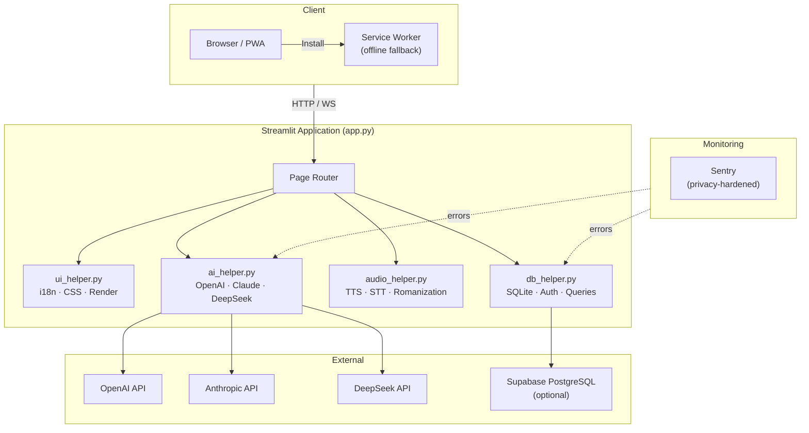
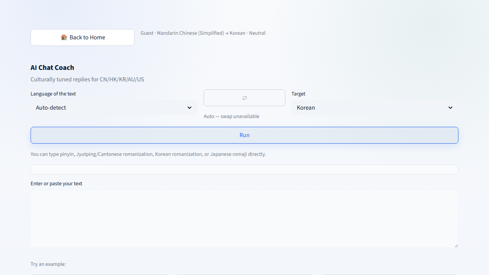
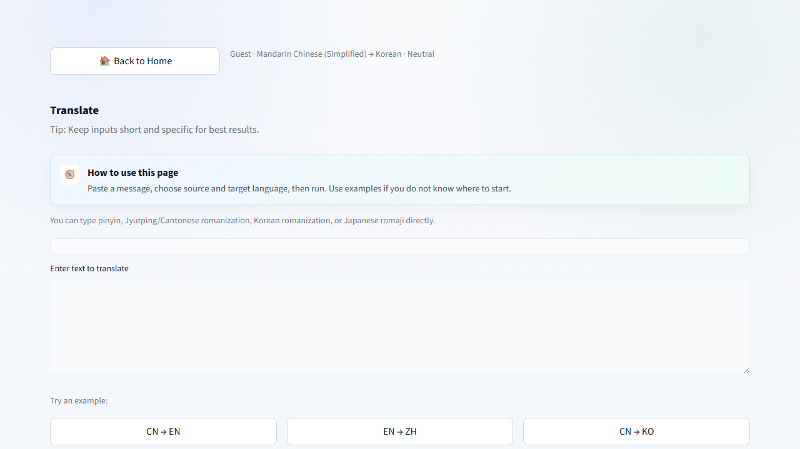
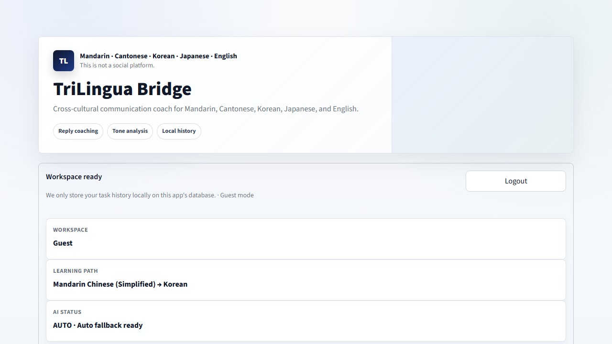
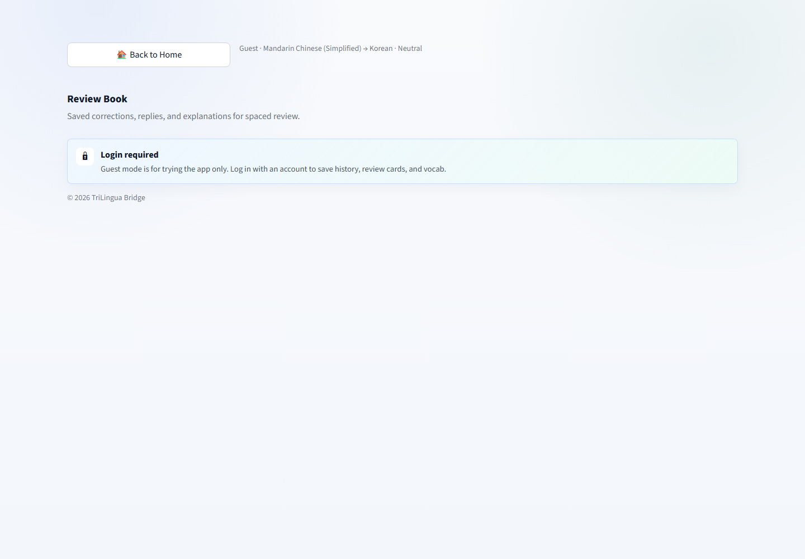
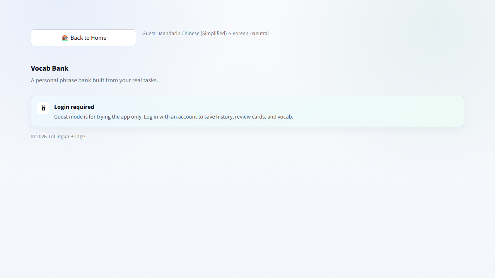
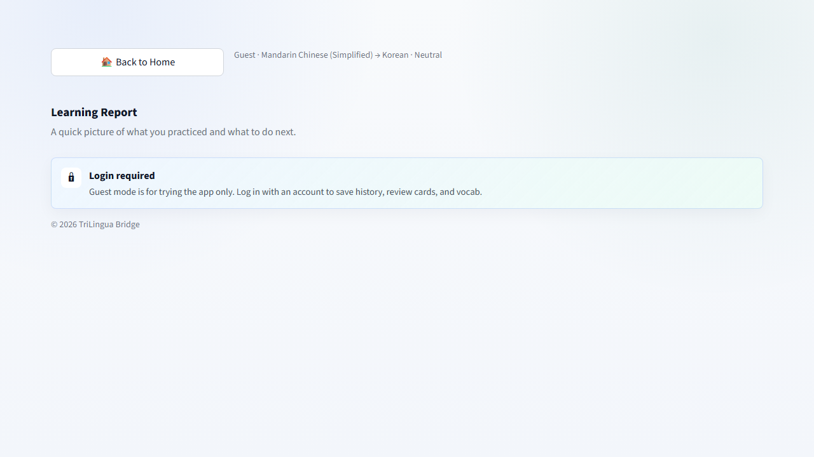
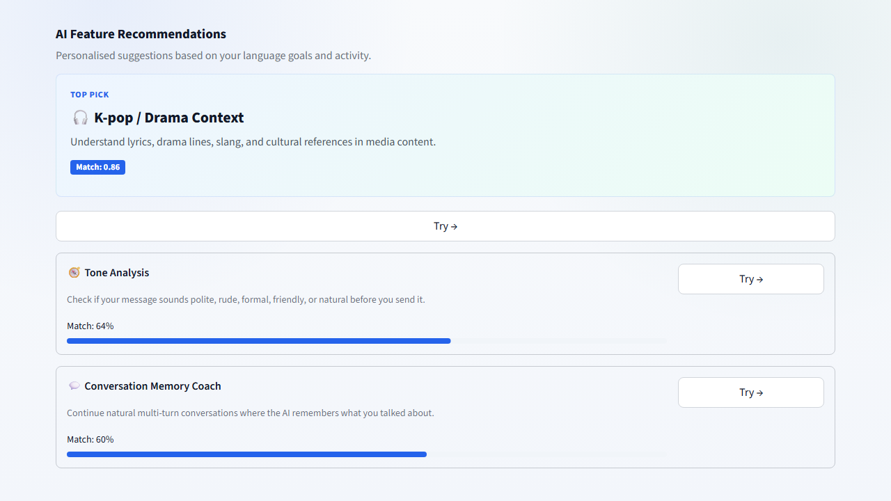

<p align="center">
  
</p>

<h1 align="center">🌐 TriLingua Bridge</h1>

<p align="center">
  <strong>AI Cross-Language Communication Coach</strong>
  <br>
  Not just translation — tone, cultural context, and "would a native actually say this?" feedback for <strong>Mandarin, Cantonese, Korean, Japanese, and English</strong>.
</p>

<p align="center">
  
  
  
  
  
  
  <br>
  
  
  
  

  <br>
  <a href="docs/architecture.md">📐 Architecture</a> ·
  <a href="PORTFOLIO.md">📖 Portfolio Notes</a> ·
  <a href="CHANGELOG.md">📋 Changelog</a> ·
  <a href="CONTRIBUTING.md">🤝 Contributing</a>
</p>

---

## 📖 Overview

**The problem:** Language learners using translation tools don't know if their message sounds natural, polite, or culturally appropriate. Google Translate gives words. ChatGPT gives text. Neither coaches.

**TriLingua Bridge** is an AI-powered communication coach that helps learners write messages that sound natural — with tone analysis, cultural calibration, pronunciation guides, and vocabulary explanations. It supports 5 languages across 5 regional modes, with automatic AI provider fallback.

| Tool | Translation | Tone coach | Cultural notes | Conversation memory | Learning workspace |
|------|:-----------:|:----------:|:--------------:|:------------------:|:------------------:|
| Google Translate | ✅ | ❌ | ❌ | ❌ | ❌ |
| DeepL | ✅ | ❌ | ❌ | ❌ | ❌ |
| ChatGPT/Claude | ✅ | ⚠️ Manual | ⚠️ Manual | ❌ | ❌ |
| **TriLingua Bridge** | ✅ | ✅ | ✅ | ✅ | ✅ |

---

## ✨ Features

| Category | Features |
|----------|----------|
| **🤖 AI Coach** | Region-aware replies, tone analysis, cultural notes, hidden meaning detection, conversation memory, quick language swap |
| **🗣️ Language Tools** | Translation, grammar correction, natural expression rewriting, vocabulary extraction, tone analysis |
| **🎧 Media** | K-pop lyrics, drama lines, internet slang, cultural context |
| **🎤 Voice** | Speech-to-text (Whisper), text-to-speech (OpenAI/gTTS), romanization (Pinyin, Jyutping, Hangul, Hepburn, IPA) |
| **🎯 Recommendations** | AI-driven feature suggestions based on goals and usage patterns |
| **📚 Workspace** | Review book, vocab bank, learning report, filterable history with CSV export, spaced repetition |
| **🌍 i18n** | 5 UI languages, 5 learning languages, region-specific cultural calibration |
| **🔐 Security** | PBKDF2-HMAC-SHA256, constant-time comparison, per-user salt, SQLite WAL, XSS prevention |

---

## 🏗️ Architecture


```mermaid
flowchart TB
    subgraph Client["Client"]
        Browser["Browser / PWA"]
        SW["Service Worker<br/>(offline fallback)"]
    end
    subgraph Streamlit["Streamlit Application (app.py)"]
        Router["Page Router"]
        UI["ui_helper.py<br/>i18n · CSS · Render"]
        AI["ai_helper.py<br/>OpenAI · Claude · DeepSeek"]
        Audio["audio_helper.py<br/>TTS · STT · Romanization"]
        DB["db_helper.py<br/>SQLite · Auth · Queries"]
    end
    subgraph External["External"]
        OpenAI["OpenAI API"]
        Anthropic["Anthropic API"]
        DeepSeek["DeepSeek API"]
        Supabase["Supabase PostgreSQL<br/>(optional)"]
    end
    subgraph Monitor["Monitoring"]
        Sentry["Sentry<br/>(privacy-hardened)"]
    end

    Client -->|HTTP / WS| Router
    Browser -->|Install| SW
    Router --> UI
    Router --> AI --> OpenAI
    AI --> Anthropic
    AI --> DeepSeek
    Router --> Audio
    Router --> DB --> Supabase
    Monitor -.->|errors| AI
    Monitor -.->|errors| DB
```

### AI Prompt Architecture

The system uses three composable guard layers for consistent multi-language output:

```
system_prompt = language_rules()       # Code definitions, output rules
              + strict_language_guard() # Output enforcement
              + quality_guard(lang)     # Field-level language rules
              + persona_instructions()  # Style hints
```

Adding a new language requires updating **one function** — no individual prompt changes.

---

## 🛠️ Tech Stack

| Layer | Technology | Why |
|-------|-----------|-----|
| **Frontend** | Streamlit + PWA | Fast AI UX prototyping, built-in state, installable as standalone app |
| **AI** | OpenAI + Anthropic + DeepSeek | Multi-provider with automatic fallback |
| **Speech** | Whisper STT + OpenAI/gTTS TTS | Industry-leading transcription + premium neural voices |
| **Database** | SQLite (local) / PostgreSQL (Supabase) | Zero-infra for dev, scalable for production |
| **Auth** | PBKDF2-HMAC-SHA256, 120k iterations | Secure local auth without third-party deps |
| **Romanization** | pypinyin + pycantonese + hangul-romanize + pykakasi + eng-to-ipa | 5-language native script support |
| **Quality** | Ruff + pytest (131 tests) | Linting and testing |
| **Monitoring** | Sentry (privacy-hardened) | Error tracking with automatic PII redaction |

---

## 🚀 Quick Start

```bash
git clone https://github.com/thomasyeung79/trilingua-bridge.git
cd trilingua-bridge
python -m venv .venv && source .venv/bin/activate
pip install -r requirements.txt
cp .env.example .env   # Edit with at least one AI API key
streamlit run app.py   # → http://localhost:8501
```

---

## 📸 Screenshots

| Coach | Translate | History |
|-------|-----------|---------|
|  |  |  |

| Review Book | Vocab Bank | Learning Report |
|------------|-----------|----------------|
|  |  |  |

| Recommendations |
|-----------------|
|  |

---

## 📁 Project Structure

```
trilingua-bridge/
├── app.py              # Streamlit entry + router
├── ai_helper.py        # AI provider abstraction + prompt layers
├── ui_helper.py        # i18n dictionary + CSS + components
├── audio_helper.py     # TTS, STT, romanization
├── db_helper.py        # SQLite + PostgreSQL dual-mode
├── error_monitor.py    # Sentry with PII redaction
├── recommendation_engine.py
├── modules/
│   ├── pages.py        # 15+ page renderers
│   └── styles.py       # Product CSS
├── pwa/                # Manifest, service worker, icons
├── tests/              # 131 unit tests
├── docs/               # Architecture, demo script, screenshots
├── .github/workflows/  # CI pipeline
└── pyproject.toml      # Ruff + pytest config
```

---

## 📐 Key Design Decisions

| Decision | Rationale |
|----------|-----------|
| **Streamlit over React/FastAPI** | Inference-heavy app — every action calls an LLM. Streamlit's rerun model maps naturally, saving 3x frontend code |
| **Three AI providers** | Automatic fallback chain (OpenAI → Anthropic → DeepSeek). Zero downtime if one provider is rate-limited |
| **SQLite + PostgreSQL** | SQLite for zero-config local dev. PostgreSQL/Supabase for production. Same SQLAlchemy queries, just swap the connection string |
| **Session state memory** | Conversation history is ephemeral by design — lost on page refresh, never stored in the database. Avoids schema migrations |
| **Atomic quota reservation** | `INSERT ... ON CONFLICT ... WHERE ... RETURNING` — single SQL statement prevents race conditions on concurrent requests |
| **Privacy-first Sentry** | Recursive redaction of API keys, passwords, JWTs, DB URLs, and Bearer tokens before any event leaves the server |

---

## 🔒 Security

| Measure | Implementation |
|---------|---------------|
| **Password storage** | PBKDF2-HMAC-SHA256, 120k iterations, 16-byte per-user salt |
| **Timing attacks** | `hmac.compare_digest` — constant-time comparison |
| **XSS prevention** | All HTML output through `html.escape` |
| **API keys** | Environment variables / Streamlit secrets only — never logged |
| **Sentry privacy** | Recursive key redaction, `send_default_pii=False`, `include_local_variables=False` |

---

## 🧪 Testing

```
131 tests passed
```

| Test suite | Focus |
|-----------|-------|
| `test_basic.py` | JSON parsing, language normalization, Sentry sanitization, secret redaction |
| `test_db.py` | SQLite/PostgreSQL dual-mode, port validation, advisory lock, login normalization |
| `test_i18n.py` | Translation keys across 5 locales — provider text, region labels, quota messages |
| `test_recommendations.py` | Goal/preference/activity scoring, top-N ranking, score breakdown |

```bash
pip install -r dev-requirements.txt
pytest tests/ -v
```

---

## 📄 License

MIT — see [LICENSE](LICENSE).

---

<p align="center">
  Built with Python, Streamlit, and a lot of coffee ☕
  <br>
  © 2026 Thomas Yeung
  <br>
  <a href="https://github.com/thomasyeung79/trilingua-bridge">GitHub</a> ·
  <a href="https://www.linkedin.com/in/thomasyeung-621578279/">LinkedIn</a>
</p>
