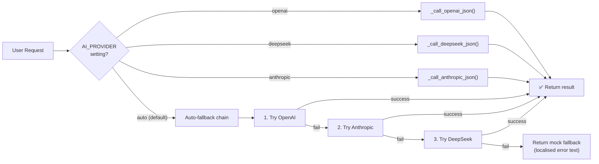
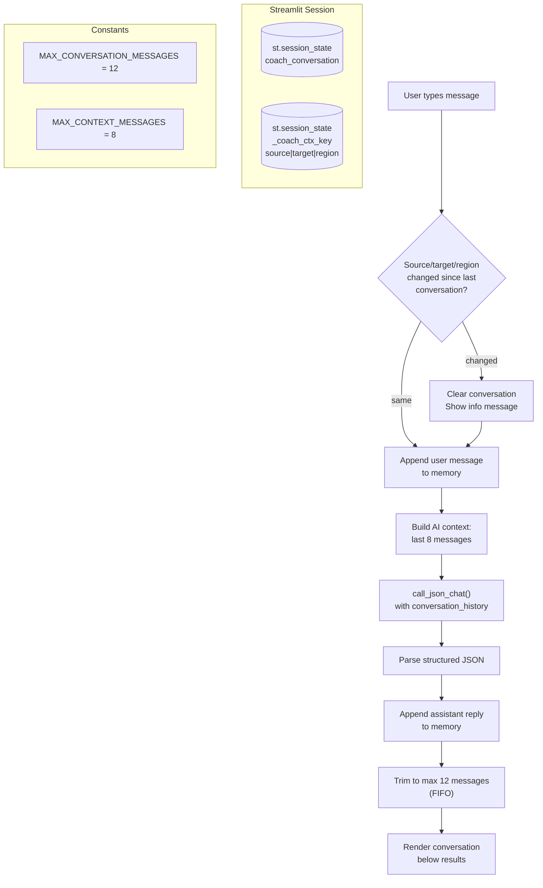
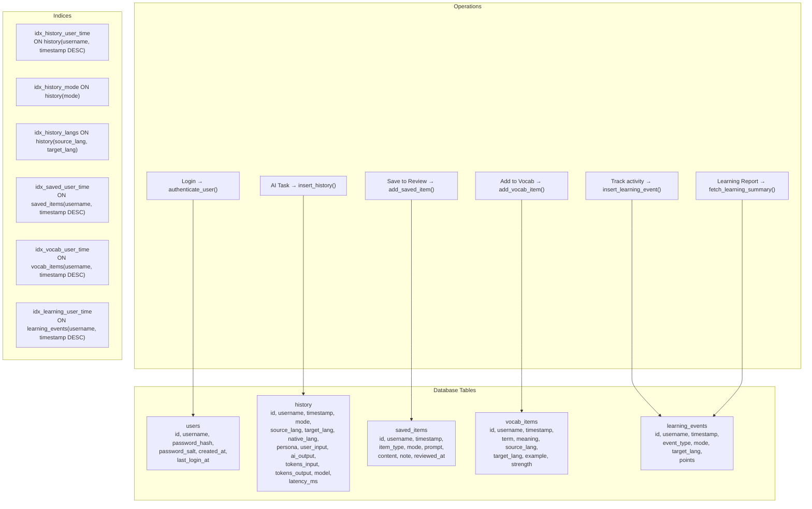
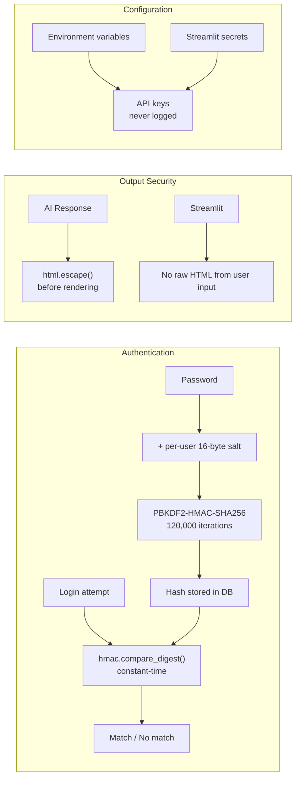
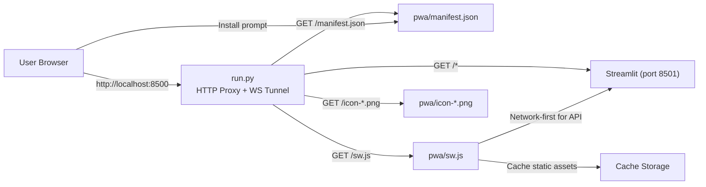

# TriLingua Bridge — Architecture

This document describes the system architecture, data flow, and key design decisions.

---

## 1. High-Level Architecture

```mermaid
flowchart TB
    subgraph Client["Client Layer"]
        Browser["Browser / PWA"]
        PWA["Service Worker<br/>(sw.js)"]
    end

    subgraph Presentation["Presentation Layer"]
        ST["Streamlit<br/>(app.py)"]
        UI["ui_helper.py<br/>i18n · CSS · Components"]
        Styles["modules/styles.py<br/>Product CSS"]
    end

    subgraph Pages["Page Router"]
        Home["Home Dashboard"]
        Coach["Coach<br/>(Conversation Memory)"]
        Translate["Translate"]
        Grammar["Grammar"]
        Natural["Natural Expression"]
        Vocab["Vocabulary"]
        Review["Review Book"]
        VocabBank["Vocab Bank"]
        Report["Learning Report"]
        History["History"]
    end

    subgraph Helpers["Business Logic Layer"]
        AI["ai_helper.py<br/>· 3 provider clients<br/>· prompt scaffolding<br/>· guard layers<br/>· structured JSON"]
        Audio["audio_helper.py<br/>· TTS (OpenAI/gTTS)<br/>· STT (Whisper)<br/>· romanization (x5)"]
        DB["db_helper.py<br/>· SQLite CRUD<br/>· PBKDF2 auth<br/>· history/vocab/review"]
    end

    subgraph Providers["External Providers"]
        OpenAI["OpenAI<br/>GPT · TTS · Whisper"]
        Anthropic["Anthropic<br/>Claude"]
        DeepSeek["DeepSeek<br/>Chat"]
        GTTS["gTTS"]
    end

    subgraph Storage["Storage"]
        SQLite[("SQLite<br/>trilingua_bridge.db<br/>WAL mode")]
    end

    Client -->|HTTP / WS| ST
    PWA -->|"/manifest.json"<br/>"/sw.js"| Client
    ST --> UI
    ST --> Styles
    ST --> Pages
    Coach -->|"conversation memory"| Session[("st.session_state")]
    Pages --> AI
    Pages --> Audio
    Pages --> DB
    AI --> OpenAI
    AI --> Anthropic
    AI --> DeepSeek
    Audio --> OpenAI
    Audio --> GTTS
    DB --> SQLite
```

---

## 2. AI Provider Fallback Flow



### How fallback works

1. User sets `AI_PROVIDER` in settings (or defaults to `"auto"`)
2. If a specific provider is selected, only that provider is tried
3. In `"auto"` mode, the chain is: **OpenAI → Anthropic → DeepSeek**
4. If all three fail, the app returns localised fallback text in the user's native language (via `localized_fallback_text()`)
5. The UI never breaks — even on total AI failure, the output structure remains valid

### Screenshot analysis exception

Screenshot analysis currently requires OpenAI Vision and does not fall back to other providers. This is a known limitation. When enabled, the UI shows a localised message explaining the restriction.

---

## 3. Conversation Memory Design



### Design rationale

| Decision | Rationale |
|----------|-----------|
| **Session state, not database** | Conversations are ephemeral sessions, not permanent records. Session state avoids schema migration and keeps the database simple |
| **12 message limit** | Prevents unbounded memory growth in a Streamlit session. 12 messages = 6 full user/assistant turns |
| **8 context messages** | Provides enough context for coherent follow-ups without exceeding token limits or wasting tokens |
| **FIFO trim** | Oldest messages are removed first — the most recent context is most relevant |
| **Context key tracking** | If source/target/region changes, memory resets. Prevents cross-language context pollution |

---

## 4. SQLite Data Flow



### Schema design notes

- **WAL mode** enables concurrent reads during Streamlit's rerun-heavy model
- **`synchronous=NORMAL`** balances durability and performance for a single-user app
- **`foreign_keys=ON`** ensures referential integrity
- **Indices** are optimised for the query patterns: history by user+time, learning aggregation by user
- **`created_at_text`** stores a human-readable timestamp alongside the Unix epoch for display

---

## 5. Prompt Architecture

The AI system prompt is assembled from composable layers:

```python
system_prompt = (
    role_description()          # "You are TriLingua Bridge..."
    + language_rules()          # Code definitions, output rules
    + strict_language_guard()   # Output compliance enforcement
    + quality_guard(lang)       # Safety, field-level language rules
    + persona_instructions()    # Style hints (neutral/friendly/teacher/strict)
)
```

Each layer is independently testable and language-agnostic. Adding a new language means updating `language_rules()` and `get_output_rule()` — no individual prompt changes.

### User prompt structure

```python
prompt = {
    "task": "advanced_chat_coach",
    "source_text": user_input,
    "source_lang": "zh",
    "target_lang": "ko",
    "native_lang": "en",
    "reply_style": "friend | region_mode=kr",
    "return_schema": { ... },       # Structured JSON expected
    "conversation_history": [       # Optional, only if memory exists
        {"role": "user", "content": "..."},
        {"role": "assistant", "content": "..."},
    ],
}
```

All user prompts are JSON-serialised and sent with `response_format={"type": "json_object"}` (OpenAI/DeepSeek) or equivalent structured output instructions (Anthropic). This ensures the UI always receives parseable data.

---

## 6. Security Architecture



### Security measures

| Measure | Where | What it protects against |
|---------|-------|------------------------|
| PBKDF2-HMAC-SHA256 | `db_helper.py:195-207` | Password cracking (offline) |
| Per-user 16-byte salt | `db_helper.py:196` | Rainbow table attacks |
| 120,000 iterations | `db_helper.py:201` | Brute-force slowdown |
| `hmac.compare_digest` | `db_helper.py:275` | Timing attacks |
| SQLite WAL + foreign keys | `db_helper.py:58-60` | Data integrity |
| `html.escape` | `ui_helper.py` passim | XSS via AI output |
| API keys from env only | `ai_helper.py:31-41` | Credential leakage via code |

---

## 7. PWA Architecture



The PWA layer is completely independent of the Streamlit application. It serves static files (manifest, service worker, icons) and proxies all other traffic. This means the PWA can be replaced or removed without touching any application code.

---

## 8. Known Architecture Limitations

| Limitation | Impact | Future direction |
|-----------|--------|-----------------|
| **Single-process Streamlit** | Cannot handle concurrent users well | Deploy behind a WSGI server or migrate to multi-session |
| **SQLite on Streamlit Cloud** | Data resets on every deploy | Swap to Turso or Supabase for hosted SQLite |
| **No REST API** | All functionality tied to Streamlit UI | Add FastAPI layer for programmatic access |
| **Inline CSS** | Hard to maintain, no caching | Extract to `.streamlit/static/` |
| **Inline TEXTS** | 74KB Python dict, hard to translate | Extract to per-language JSON files |
| **No message queue** | Long AI calls block the UI thread | Streamlit's async support or task queue |

---

*Last updated: June 2026*
